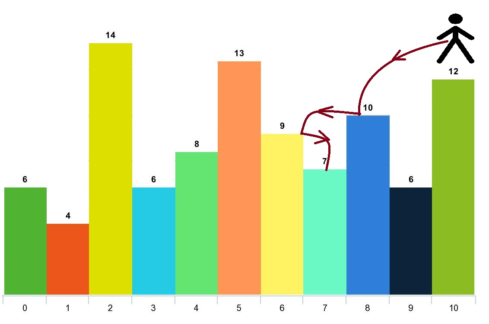

# 跳跃游戏 V

### 题目
[leetcode 1340. 跳跃游戏 V](https://leetcode.cn/problems/jump-game-v/description/)


```
给你一个整数数组 arr 和一个整数 d 。每一步你可以从下标 i 跳到：
    1. i + x ，其中 i + x < arr.length 且 0 < x <= d 。
    2. i - x ，其中 i - x >= 0 且 0 < x <= d 。
除此以外，你从下标 i 跳到下标 j 需要满足：
    arr[i] > arr[j] 且 arr[i] > arr[k] 
其中下标 k 是所有 i 到 j 之间的数字（更正式的，min(i, j) < k < max(i, j)）。

你可以选择数组的任意下标开始跳跃。请你返回你 最多 可以访问多少个下标。
请注意，任何时刻你都不能跳到数组的外面。

示例 1:
```


```
输入：arr = [6,4,14,6,8,13,9,7,10,6,12], d = 2
输出：4
解释：
    你可以从下标 10 出发，然后如上图依次经过 10 --> 8 --> 6 --> 7 。
    注意，如果你从下标 6 开始，你只能跳到下标 7 处。你不能跳到下标 5 处因为 13 > 9 。你也不能跳到下标 4 处，因为下标 5 在下标 4 和 6 之间且 13 > 9 。
    类似的，你不能从下标 3 处跳到下标 2 或者下标 1 处。

示例 2：
输入：arr = [3,3,3,3,3], d = 3
输出：1
解释：你可以从任意下标处开始且你永远无法跳到任何其他坐标。

示例 3：
输入：arr = [7,6,5,4,3,2,1], d = 1
输出：7
解释：从下标 0 处开始，你可以按照数值从大到小，访问所有的下标。

示例 4：
输入：arr = [7,1,7,1,7,1], d = 2
输出：2

示例 5：
输入：arr = [66], d = 1
输出：1

提示：
1. 1 <= arr.length <= 1000
2. 1 <= arr[i] <= 10^5
3. 1 <= d <= arr.length
```

### 暴力解题思路
```
1. 获取每一个点可以跳到的位置
2. 用回溯的方式，记录从某一下标所能到的所有路径
3. for循环arr数组，获取所有下标所能到的所有路径
4. 对比，获取最长路径
```

#### golang代码
```go
func maxJumps(arr []int, d int) int {
	paths := make([]int, 0)
	maxPath := 0
	var dt func(int)
	dt = func(index int) {
		fmt.Println(paths)
		canReachIndexs := allJumpIndexs(arr, index, d)
		if len(canReachIndexs) == 0 {
			if len(paths) > maxPath {
				maxPath = len(paths)
			}
			return
		}

		for i := 0; i < len(canReachIndexs); i++ {
			paths = append(paths, canReachIndexs[i])
			dt(canReachIndexs[i])
			paths = paths[:len(paths)-1]
		}

	}

	for i := 0; i < len(arr); i++ {
		paths = append(paths, i)
		dt(i)
		paths = paths[:len(paths)-1]
	}

	return maxPath
}

// index 所能跳到的所有位置
func allJumpIndexs(arr []int, index, d int) []int {
	res := make([]int, 0)
	maxIndex := index + d // index所能到达的最大下标
	if maxIndex > len(arr)-1 {
		maxIndex = len(arr) - 1
	}

	for i := index + 1; i <= maxIndex; i++ {
		if arr[i] < arr[index] {
			res = append(res, i)
		} else {
			break
		}
	}

	minIndex := index - d // index所能到达的最小下标
	if minIndex < 0 {
		minIndex = 0
	}

	for i := index - 1; i >= minIndex; i-- {
		if arr[i] < arr[index] {
			res = append(res, i)
		} else {
			break
		}
	}

	return res
}

```

#### 性能分析
时间复杂度比较高，容易超出时间限制。

### 优化思路
```
上述暴力算法中，存在多个for循环，且重复计算某一点的最大可访问数量。导致计算计算过长。

在递归遍历中，回发生某一位置被重复访问的情况，可以将计算出最大访问数据的位置用map保存起来，后面直接获取，防止重复计算。

优化采用回溯+动态规划思想，用dp[i]记录i下标所能访问的最大值

核心点在于，dp[i]如果计算，递归采用从底层向外不断+1获取。
随机传入一个下标index，获取index所能达到的所有位置all[]，
    1. 如果len(all)=0，则到达递归函数底部，返回 1 。
    2. 如果len(all)>0，遍历all，获取每个元素所能访问的最大值，再 +1 为index的最大访问数。
```

#### golang代码实现
```go
func maxJumps(arr []int, d int) int {
	dp := make(map[int]int) // 记录每个点所能访问数的最大值

	var dt func(int) int
	dt = func(index int) int {
		if mc, ok := dp[index]; ok { // 已经计算出最大访问数的直接返回
			return mc
		}

		canReachIndexs := allJumpIndexs(arr, index, d) // 获取所有可以到达的下标
		maxCount := 1                                  // 位置本身为一个可达下标，所以默认为1
		for i := 0; i < len(canReachIndexs); i++ {
			maxCount = max(dt(canReachIndexs[i])+1, maxCount) // 可触达点的最大值 + 本身 = 本身位置可访问的最大值
		}
		dp[index] = maxCount
		return maxCount
	}

	res := 0
	for i := 0; i < len(arr); i++ {
		res = max(dt(i), res)
	}
	return res
}

func max(a, b int) int {
	if a > b {
		return a
	}
	return b
}
```