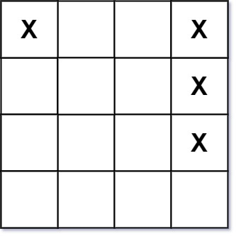

# 甲板上的战舰

## 题目
[甲板上的战舰](https://leetcode.cn/problems/battleships-in-a-board/description)

```
给你一个大小为 m x n 的矩阵 board 表示甲板，其中，每个单元格可以是一艘战舰 'X' 或者是一个空位 '.' ，返回在甲板 board 上放置的 战舰 的数量。

战舰 只能水平或者垂直放置在 board 上。换句话说，战舰只能按 1 x k（1 行，k 列）或 k x 1（k 行，1 列）的形状建造，其中 k 可以是任意大小。
两艘战舰之间至少有一个水平或垂直的空位分隔 （即没有相邻的战舰）。

示例 1：
输入：board = [["X",".",".","X"],[".",".",".","X"],[".",".",".","X"]]
输出：2

示例 2：
输入：board = [["."]]
输出：0

提示：
1. m == board.length
2. n == board[i].length
3. 1 <= m, n <= 200
4. board[i][j] 是 '.' 或 'X'

进阶：你可以实现一次扫描算法，并只使用 O(1) 额外空间，并且不修改 board 的值来解决这个问题吗？
```


## 解题思路
```
我们知道，任意两个战舰之间是不相邻；从左往右，从上往下，遍历矩阵。
如果任意一点的左边和上边 不存在“X”，即可为一艘战舰。
所以，一艘战舰需要满足以下条件：
1. board[i][j]=’X’；
2. board[i][j−1]=’.’；
3. board[i−1][j]=’.’；
```

## golang代码
```go
func countBattleships(board [][]byte) int {
	count := 0
	for row, nums := range board {
		for col, s := range nums {
			if string(s) == "X" {
				if row > 0 && string(board[row-1][col]) != "." {
					continue
				}
				if col > 0 && string(board[row][col-1]) != "." {
					continue
				}
				count++
			}
		}
	}

	return count
}
```